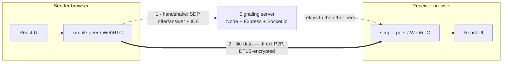

# P2P Web Share

Direct, browser-to-browser file transfer. Drop a file, share a link, and the
recipient connects **directly** to you over WebRTC to stream it. A lightweight
Socket.io server only brokers the initial handshake — it never touches file data.

## Architecture



## How it works

1. The **sender** clicks *Share a File*; the server creates a room and returns a
   link like `/?room=ABC123`.
2. The **receiver** opens that link and joins the same room.
3. The browsers exchange WebRTC **offer/answer + ICE** through the server.
4. A direct, **DTLS-encrypted** data channel opens between the two browsers.
5. The file streams in **16 KB chunks** with backpressure — the server is now idle.
6. The receiver reassembles the chunks, **verifies the SHA-256 hash**, and the
   file **downloads automatically**.

## Features

- **Share rooms** — drag-and-drop or pick a file (up to 50 MB) and get a unique
  room link to share.
- **Socket.io signaling** — coordinates the WebRTC handshake only; zero file data
  passes through the server.
- **Direct P2P transfer** — files stream over a WebRTC data channel in 16 KB
  chunks with **backpressure** so the channel buffer never overflows.
- **SHA-256 integrity** — the sender hashes the file up front; the receiver
  re-hashes the reassembled file and saves it only if the hashes match.
- **Live progress** — real-time percentage and transfer speed (MB/s) on both
  ends, plus connection status.
- **Graceful disconnects** — if a peer closes its tab, the other side is notified
  instead of hanging or crashing.
- **Auto-download** — the verified file is saved automatically on completion.

## Tech stack

| Layer            | Technology                    |
| ---------------- | ----------------------------- |
| Frontend         | React + Vite + Tailwind CSS   |
| P2P transport    | WebRTC via [simple-peer]      |
| Signaling server | Node.js + Express + Socket.io |
| Integrity        | Web Crypto API (SHA-256)      |

[simple-peer]: https://github.com/feross/simple-peer

## Project structure

```
backend/
  server.js              Express + Socket.io signaling server
  test-signaling.js      Automated signaling tests (npm test)
frontend/
  public/illustrations/  Bundled SVG artwork
  src/
    App.jsx              Landing page + room creation/join
    components/
      Sender.jsx         Sends the file (WebRTC initiator)
      Receiver.jsx       Receives, verifies, and downloads
      icons.jsx          Inline SVG icon set
    utils/crypto.js      SHA-256 + byte formatting helpers
```

## Run locally

In two terminals:

**1 · Backend**
```bash
cd backend
npm install
npm start            # http://localhost:4000
```

**2 · Frontend**
```bash
cd frontend
npm install
npm run dev          # http://localhost:5173
```

## Usage

1. Open `http://localhost:5173` and click **Share a File**.
2. Copy the room link and open it in a second tab, window, or device.
3. Back on the sender, drag in a file and click **Send File**.
4. The receiver verifies the file and downloads it automatically.

## Configuration

Environment variables (see `.env.example` in each folder):

| Variable           | Where    | Default                 |
| ------------------ | -------- | ----------------------- |
| `PORT`             | backend  | `4000`                  |
| `FRONTEND_URL`     | backend  | `http://localhost:5173` |
| `VITE_BACKEND_URL` | frontend | `http://localhost:4000` |

## Testing

An automated test covers room creation, handshake relay, peer-disconnect, and
room-full handling:

```bash
cd backend
npm test
```

## Deployment

- **Frontend** → Vercel / Netlify. Build `npm run build`, output `dist`; set
  `VITE_BACKEND_URL` to the deployed backend URL.
- **Backend** → Render / Railway. Start `npm start`; set `FRONTEND_URL` to the
  deployed frontend URL.

## A note on networks

WebRTC needs a direct route between peers, which works on open networks and the
internet. Restrictive networks (e.g. campus or corporate Wi-Fi) may block P2P —
use a mobile hotspot or run both tabs on one machine. Production apps add a
**TURN server** to relay through such firewalls; a deliberate next step, not this MVP.

## License

MIT
