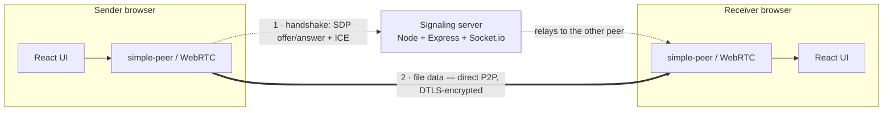

<div align="center">

# P2P Web Share

### Direct, browser-to-browser file transfer — no file ever touches a server.

Drop a file, share a link, and the recipient connects **directly** to your
browser over WebRTC to stream it. A lightweight Socket.io server only brokers
the initial handshake; it never sees, stores, or relays any file data.


</div>

---

## Live demo

| Service | URL |
| ------------------- | --------------------------------------------------------------- |
| **App** (try it)    | https://p2-p-web-share-two.vercel.app                           |
| **Backend health**  | https://p2p-web-share-production-d718.up.railway.app/health     |

> Open the app, click **Share a File**, then open the generated link in a second
> tab or device to receive. Hosted on free tiers, so the backend may take a few
> seconds to wake on the first request.

---

## Features

- **Share rooms** - drag-and-drop or pick a file (up to 50 MB) and get a unique
  room link to share.
- **Socket.io signaling** - coordinates the WebRTC handshake only; **zero file
  data** passes through the server.
- **Direct P2P transfer** - files stream over a WebRTC data channel in 16 KB
  chunks with **backpressure** so the channel buffer never overflows.
- **SHA-256 integrity** - the sender hashes the file up front; the receiver
  re-hashes the reassembled file and saves it **only if the hashes match**.
- **Live progress** - real-time percentage and transfer speed (MB/s) on both
  ends, plus connection status.
- **Graceful disconnects** - if a peer closes its tab, the other side is notified
  instead of hanging or crashing.
- **Auto-download** - the verified file is saved automatically on completion.

---

## Architecture



Dashed lines are the one-time handshake through the server; the bold line is the
file itself, flowing **directly** between the two browsers.

### How it works

1. The **sender** clicks *Share a File*; the server creates a room and returns a
   link like `/?room=ABC123`.
2. The **receiver** opens that link and joins the same room.
3. The browsers exchange WebRTC **offer / answer + ICE candidates** through the
   server — the only job it has.
4. A direct, **DTLS-encrypted** data channel opens between the two browsers.
5. The file streams in **16 KB chunks** with backpressure; the server is now idle.
6. The receiver reassembles the chunks, **verifies the SHA-256 hash**, and the
   file **downloads automatically**.

---

## Tech stack

| Layer                | Technology                            |
| -------------------- | ------------------------------------- |
| **Frontend**         | React + Vite + Tailwind CSS           |
| **P2P transport**    | WebRTC via [simple-peer]              |
| **Signaling server** | Node.js + Express + Socket.io         |
| **Integrity**        | Web Crypto API (SHA-256)              |
| **Hosting**          | Vercel (frontend) · Railway (backend) |

[simple-peer]: https://github.com/feross/simple-peer

---

## Project structure

```text
P2P-Web-Share/
│
├── backend/                     # Node.js signaling server
│   ├── server.js                # Express + Socket.io — relays the WebRTC handshake
│   ├── test-signaling.js        # Automated signaling tests  (npm test)
│   ├── package.json
│   └── .env.example             # PORT, FRONTEND_URL
│
├── frontend/                    # React + Vite client
│   ├── public/
│   │   └── illustrations/       # Bundled SVG artwork (served as-is)
│   ├── src/
│   │   ├── App.jsx              # Landing page · create / join a room
│   │   ├── main.jsx             # React entry point
│   │   ├── index.css           # Tailwind + global styles
│   │   ├── components/
│   │   │   ├── Sender.jsx       # Hashes + streams the file (WebRTC initiator)
│   │   │   ├── Receiver.jsx     # Receives, verifies (SHA-256), auto-downloads
│   │   │   └── icons.jsx        # Inline SVG icon set
│   │   └── utils/
│   │       └── crypto.js        # SHA-256 + byte-size helpers
│   ├── index.html
│   ├── vite.config.js           # Vite + Node polyfills (required by simple-peer)
│   ├── tailwind.config.js
│   ├── package.json
│   └── .env.example             # VITE_BACKEND_URL
│
└── README.md
```

---

## Run locally

You'll need **Node.js 18+** and two terminals.

**1 · Backend**
```bash
cd backend
npm install
npm start            # http://localhost:4000
```

**2 · Frontend**
```bash
cd frontend
npm install
npm run dev          # http://localhost:5173
```

### Usage

1. Open `http://localhost:5173` and click **Share a File**.
2. Copy the room link and open it in a second tab, window, or device.
3. Back on the sender, drag in a file and click **Send File**.
4. The receiver verifies the file and downloads it automatically.

---

## Configuration

Environment variables (templates in each folder's `.env.example`):

| Variable           | Side     | Default                 | Purpose                                 |
| ------------------ | -------- | ----------------------- | --------------------------------------- |
| `PORT`             | backend  | `4000`                  | Port the signaling server listens on    |
| `FRONTEND_URL`     | backend  | `http://localhost:5173` | Allowed CORS origin (your frontend URL) |
| `VITE_BACKEND_URL` | frontend | `http://localhost:4000` | Backend URL the client connects to      |

---

## Testing

The signaling server ships with an automated test covering room creation, the
handshake relay, peer-disconnect notifications, and room-full handling:

```bash
cd backend
npm test
```

---

## Deployment

Free-tier friendly, split across two hosts:

- **Frontend -> Vercel / Netlify.** Root directory `frontend`, framework **Vite**,
  build `npm run build`, output `dist`. Set `VITE_BACKEND_URL` to the backend URL.
- **Backend -> Railway / Render.** Root directory `backend`, start `npm start`.
  Set `FRONTEND_URL` to the deployed frontend URL (for CORS); the host provides
  `PORT` automatically.

---

## A note on networks

WebRTC needs a direct route between peers, which works on open networks and
across the internet. Some restrictive networks (e.g. campus or corporate Wi-Fi)
block peer-to-peer connections — use a mobile hotspot, or run both tabs on one
machine. Production apps add a **TURN server** to relay through such firewalls;
that's a deliberate next step, not part of this MVP.

---

## License

MIT — free to use, modify, and learn from.
